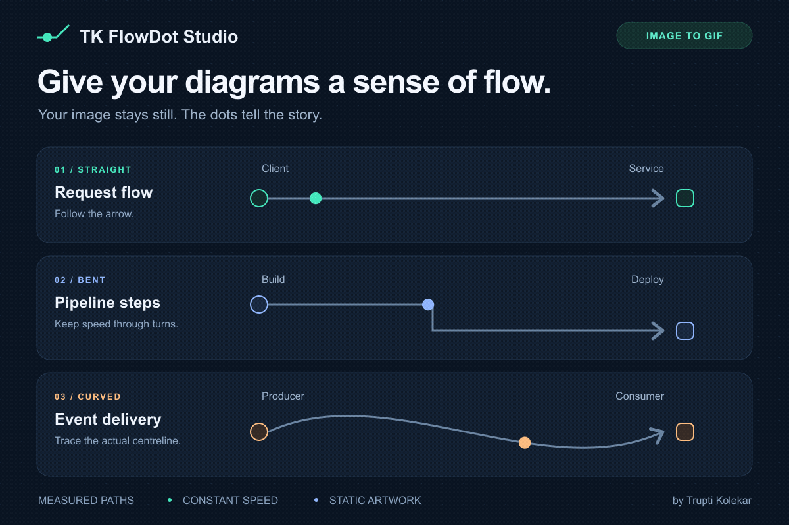
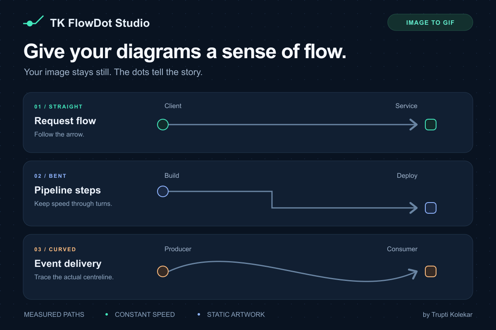

<div align="center">

# TK FlowDot Studio

### Give your diagrams a sense of flow.

Turn the arrows and lines in a static image into a moving-dot GIF.<br>
Built for architecture diagrams, pipelines, workflows and technical explainers.

[](LICENSE)
[](skills/tk-flowdot-studio/SKILL.md)
[](#quick-start)

[Quick start](#quick-start) · [Install the skill](#install-the-skill) · [Map your image](docs/guide.md) · [Configuration](skills/tk-flowdot-studio/references/config.md)



**Your image stays still. The dots tell the story.**

</div>

## From image to animation

| 1. Start with a static image | 2. Add flow-dot motion |
| :---: | :---: |
|  |  |
| Keep your layout, labels and arrows. | Export a GIF you can embed or share. |

**How it works:** an AI assistant inspects the image and maps its connector paths. A local renderer moves dots along those measured paths at constant speed. You can also write the route file yourself and use the CLI directly.

This is AI-assisted mapping with deterministic rendering. The script does not automatically detect every line in an image.

## What you can make

| Use case | Show the flow |
| :--- | :--- |
| System architecture | Requests between clients, gateways and services |
| CI/CD pipelines | Progress through build, test and deployment steps |
| Event-driven systems | Messages moving between producers and consumers |
| Workflows and teaching | Direction through a process without moving its labels |

- **Follow the actual path:** straight, diagonal, bent, or curved with sampled points.
- **Keep the artwork still:** only the dot overlays animate.
- **Control the motion:** colour, diameter, speed, starting phase and direction per route.
- **Work at your image size:** no fixed aspect ratio or branded template.
- **Render locally:** Python, Pillow and FFmpeg. No rendering API or API key.
- **Inspect before exporting:** a route preview shows your mapped centreline and direction.

## Quick start

You need **Python 3.10+** and **FFmpeg on PATH**. Install FFmpeg using your operating system's package manager, for example `brew install ffmpeg` on macOS or `sudo apt install ffmpeg` on Ubuntu. See [FFmpeg downloads](https://ffmpeg.org/download.html) for other platforms.

```bash
git clone https://github.com/truptik-devops-pro/tk-flowdot-studio.git
cd tk-flowdot-studio
python3 -m venv .venv
source .venv/bin/activate
python -m pip install -r skills/tk-flowdot-studio/requirements.txt
ffmpeg -version
mkdir -p output
```

On Windows PowerShell, use `py -m venv .venv` and `.venv\Scripts\Activate.ps1` instead of the two environment commands above. Use single-line versions of commands below in PowerShell, where `\` is not a continuation character.

**Preview the demo's measured routes:**

```bash
python skills/tk-flowdot-studio/scripts/flowdot.py preview \
  --image examples/demo.png \
  --config examples/demo.json \
  --output output/routes-preview.png
```

**Convert the demo image to a GIF:**

```bash
python skills/tk-flowdot-studio/scripts/flowdot.py render \
  --image examples/demo.png \
  --config examples/demo.json \
  --output output/demo.gif
```

Open `output/demo.gif`. Existing output files are protected; choose a new filename or explicitly add `--force` to replace one.

## Install the skill

The self-contained skill lives in [`skills/tk-flowdot-studio`](skills/tk-flowdot-studio). Keep its instructions, script, requirements and reference together.

### GitHub CLI

With a GitHub CLI version that supports the preview `gh skill` commands, install for Codex at user scope:

```bash
gh skill install truptik-devops-pro/tk-flowdot-studio tk-flowdot-studio --agent codex --scope user
```

See the [GitHub CLI installation reference](https://cli.github.com/manual/gh_skill_install) for other agent destinations and version pinning. Runtime requirements below still apply.

### Skills CLI

You can also discover and install the skill through the [Skills CLI](https://skills.sh/docs/cli):

```bash
npx skills add truptik-devops-pro/tk-flowdot-studio
```

Choose your agent when prompted. This installs the skill files; install Python, Pillow and FFmpeg separately as described in [Quick start](#quick-start).

### Codex

Ask Codex's skill installer:

```text
Use $skill-installer to install the skill from
https://github.com/truptik-devops-pro/tk-flowdot-studio/tree/main/skills/tk-flowdot-studio
```

Restart or refresh your agent's skill discovery after installing. The Python environment still needs Pillow and FFmpeg as described above.

For a manual install from this repository, copy the complete skill folder into `~/.agents/skills/tk-flowdot-studio`, checking that it does not already exist. This is Codex's documented user-level skills location. See [OpenAI's local skill documentation](https://learn.chatgpt.com/docs/build-skills#where-codex-loads-local-skills).

### Other agents

For agents that support the [Agent Skills format](https://agentskills.io/specification), copy the whole `skills/tk-flowdot-studio` directory into that agent's documented skills location. Shell execution, image inspection, Python and FFmpeg are required. Loading `SKILL.md` alone does not install runtime dependencies. Agent-specific compatibility beyond Codex has not been tested.

### Then ask

Attach your diagram, or provide its local file path:

```text
Use $tk-flowdot-studio to animate the arrows in this image.
Use teal flow dots moving toward the arrowheads.
Keep all text, icons and the background unchanged.
Inspect the route preview, then export the GIF and route JSON.
```

For preview only, add: `Show me the route preview and wait before rendering.`

## Animate your own image

1. Export your diagram as a static PNG or JPEG.
2. Ask the skill to inspect it and map the line centrelines, or write your own route JSON.
3. Inspect the route preview at the original resolution. Correct any line, bend or direction that is wrong.
4. Render the GIF and inspect it at the size where you will share it.

Start with the [practical guide](docs/guide.md), then use the [configuration reference](skills/tk-flowdot-studio/references/config.md) for exact field names. The demo includes its [source SVG](examples/demo.svg), [PNG](examples/demo.png) and [route JSON](examples/demo.json).

## Honest limits

- Curves use closely spaced polyline points. Native SVG paths and automatic line tracing are not included.
- Dots wrap at each route's endpoint. Independent route periods may cause a visible reset when the whole GIF restarts. Seamless loops require matching periods.
- GIF reduces the image to a shared colour palette. Transparent input is flattened onto white.
- Existing stationary dots remain in your image. The renderer does not erase or redesign the source.
- Branches animate independently. This is a visual explainer, not a traffic simulator.

## Development

```bash
python -m unittest discover -s tests -v
```

Tests exercise geometry, input validation, file protection and actual GIF output. FFmpeg is required for the integration checks. See [CONTRIBUTING.md](CONTRIBUTING.md) for focused contributions.

## About

Created by [Trupti Kolekar](https://github.com/truptik-devops-pro) to make technical diagrams easier to explain. TK FlowDot Studio generalizes the constant-speed, measured-centreline motion technique from her original NGINX animation workflow. The demo artwork is original and the reusable skill contains no fixed NGINX layout or branding.

Released under the [MIT License](LICENSE).
