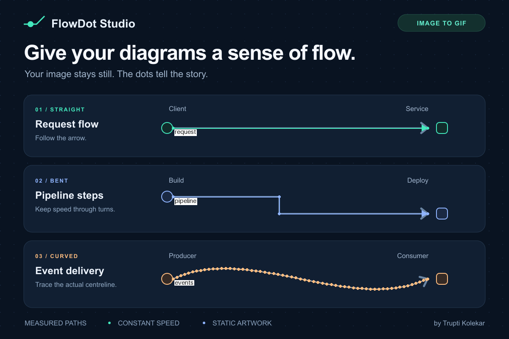

# A practical guide to image-to-GIF flow animation

The best result begins with a clean image and a well-measured route. This guide works with the AI skill or the direct CLI.

## 1. Choose a source image

Use a static PNG or JPEG with clear connector lines. Export vector diagrams at the exact pixel size you want to share. Small source text will still be small in the GIF. Keep a separate original.

If your source has transparency, place it on your intended background before rendering if you do not want white. FlowDot Studio flattens transparency onto white. It will preserve any large stationary dots already in the artwork.

## 2. Map one route first

Open the image at full resolution. Record the centre of the connector at its beginning, each turn, and its end. Use image pixel coordinates, not coordinates from a resized chat preview.

For an 800 by 400 example, a line might start at `(100,140)`, turn at `(380,140)`, turn again at `(380,260)`, and end at `(700,260)`. Those four points define the bent path:

```json
{
  "image_size": [800, 400],
  "defaults": {"speed": 200, "diameter": 12, "color": "#800020"},
  "routes": [
    {"id": "request", "points": [[100,140],[380,140],[380,260],[700,260]]}
  ]
}
```

Save this as `routes.json` only after replacing the example dimensions and points with measurements from your image. See the [full configuration contract](../skills/flowdot-studio/references/config.md).

**With the skill:** ask the assistant to inspect the image and generate this JSON for you. Review its route overlay before trusting those measurements.

## 3. Inspect the preview

From the repository root with your Python environment active:

```bash
python skills/flowdot-studio/scripts/flowdot.py preview \
  --image diagram.png --config routes.json --output routes-preview.png
```

Check the overlay against the real line:

- Does it run down the centre rather than along an edge?
- Does it follow every corner rather than taking a shortcut?
- Does it follow the visible arrowhead direction?
- Does the moving dot have enough room to avoid covering text or icons?

For a curve, add more points wherever straight segments visibly depart from the line. Split junctions into independent routes. A crossing is not necessarily a connection.

Here is the bundled demo's diagnostic overlay. Its coloured vertices and route labels are preview aids and do not appear in the exported animation.

Route-ID labels are positioned near path starts and can cover nearby node text. Keep the original image alongside the preview to read that text. This does not affect the final GIF.



## 4. Tune the movement

The default 30 ms frame delay gives 33.33 frames/s. A 12 px dot moving at 200 px/s advances 6 px per frame, producing overlapping positions. Increase dot size or lower speed when motion looks jumpy.

| Want to change | Set |
| :--- | :--- |
| Slower movement | Lower `speed` |
| Larger dots | Increase `diameter` |
| Opposite direction | `reverse: true` |
| Staggered starts | Different `phase` values from 0 up to, but not including, 1 |
| Different colours | Per-route `color` values such as `#43E8BD` |
| A longer clip | Increase `frames` |
| Several dots on a path | Repeat points under unique route IDs with different phases |

Speed is distance per second. A longer route takes longer to traverse at the same speed. Do not force every route to share a traversal duration unless changing physical speed is your intent.

## 5. Render and inspect

```bash
python skills/flowdot-studio/scripts/flowdot.py render \
  --image diagram.png --config routes.json --output diagram-flow.gif
```

The renderer prints actual output metadata and verifies encoded frame timing before completing. Open the result, watch at least two loops, and check the first, middle, last and boundary frames. Check small/mobile display too. The image should remain still outside the moving-dot regions.

The default clip lasts 4.5 seconds. Arbitrary paths can reset when the clip restarts. For a perfectly periodic boundary, every route must travel an integer number of path lengths during that duration. Adjusting speeds to force that changes the motion, so make that choice deliberately.

## Troubleshooting

| Symptom | What to check |
| :--- | :--- |
| `ffmpeg` missing | Install FFmpeg and ensure it is on the same shell's PATH |
| `No module named PIL` | Activate the environment and install the skill's requirements |
| Wrong image dimensions | JSON must use the source image's exact width and height |
| Dot cuts across a corner | Add the missing bend point |
| Dot drifts away from a curve | Add closer centreline points and inspect the preview |
| Dot runs backwards | Reverse the point order or set `reverse`, not both |
| Output exists | Choose a versioned name or use `--force` intentionally |
| Colours differ slightly | GIF palette quantization is expected; retain the original PNG |
| GIF is large | Use a smaller source or shorter clip deliberately; remap coordinates if resizing |
| Animation is invisible | Check dot contrast, speed and the selected routes |
| A loop jumps | The clip duration and independent route periods do not align |

## Sharing

Embed the GIF in a README with ``. Keep a static PNG nearby for people who prefer still images or cannot view animation. Support for animated GIFs varies by publishing platform.

## How rendering works

The renderer creates a fresh base-image copy per frame, draws antialiased dots at arc-length positions, and streams the frames into a lossless FFV1 intermediate. FFmpeg builds a shared palette and applies it to the entire GIF. This avoids a separate colour palette drifting from frame to frame. See the upstream [palettegen and paletteuse documentation](https://ffmpeg.org/ffmpeg-filters.html#palettegen) and [Pillow GIF documentation](https://pillow.readthedocs.io/en/stable/handbook/image-file-formats.html#gif).
